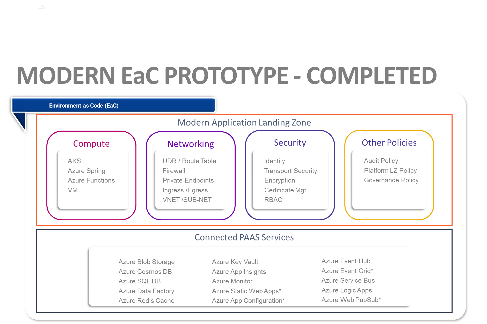
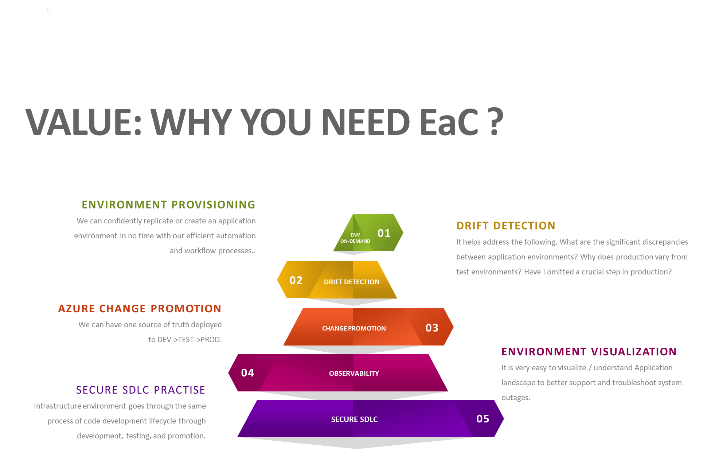
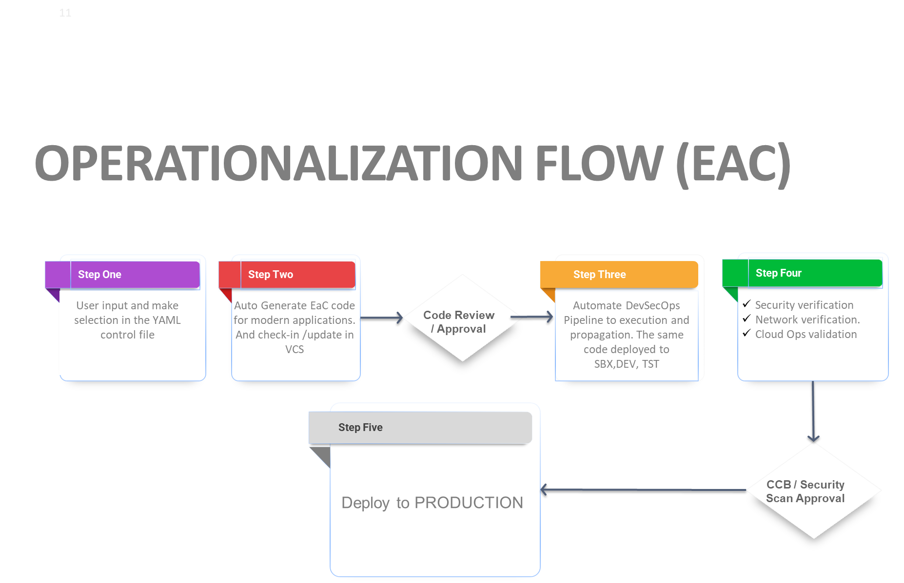
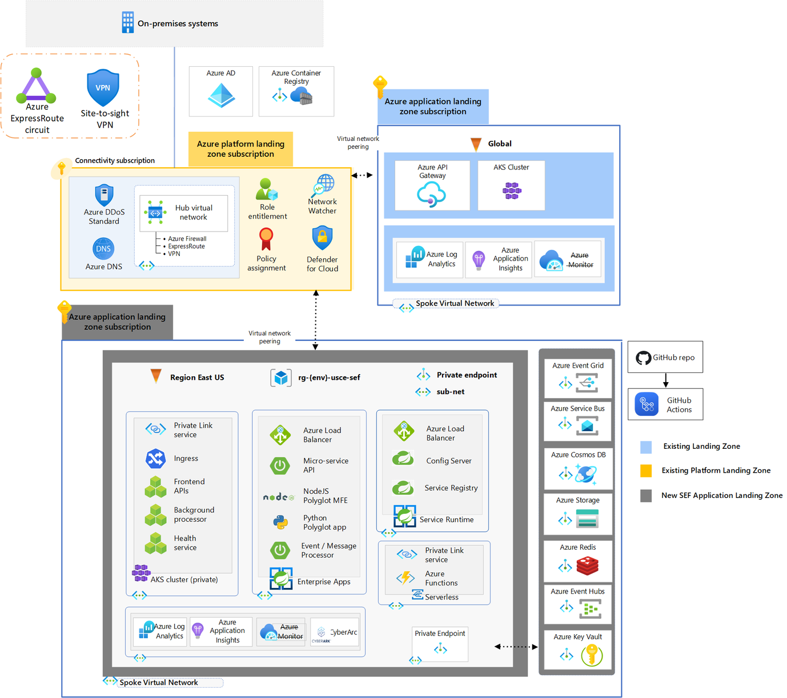

**"Environment as code"**
is a practice of managing software development environments using code, treating them as code artifacts. It automates the provisioning and configuration of environments, ensuring consistency, reproducibility, and easier collaboration. This approach streamlines setup, improves reliability, and enhances portability across different deployment environments.
-----------------------------------------------------------------------------
**Supported Azure Services**

----------------------------------------------------------------------------

----------------------------------------------------------------------------

-----------------------------------------------------------------------------
**EaC Template for Medline Modern Apps**
